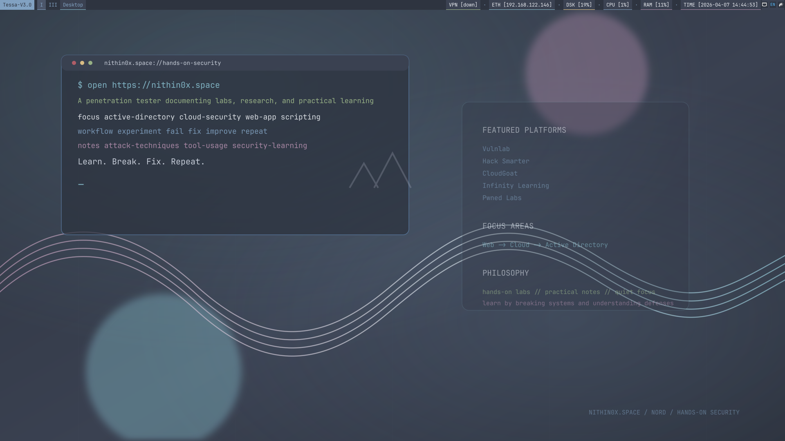
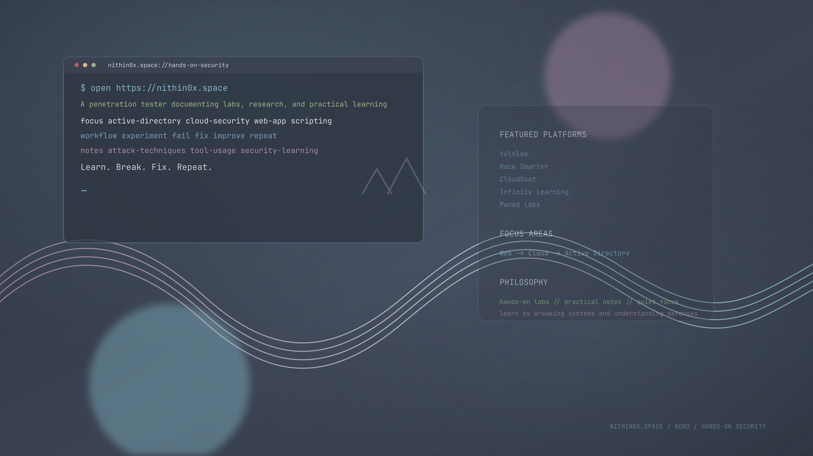

# nithin0x Nord i3 Dotfiles

A Nord-themed i3 desktop setup built around the config currently running on my `igris` VM. It includes i3, Polybar, Alacritty, Rofi, tmux, GTK 2/3/4, Firefox tweaks, Obsidian reference config, the `Nordic` GTK theme, and a custom wallpaper inspired by `nithin0x.space`.

## Preview





## Included

- `i3wm` with Nord colors and wallpaper startup
- `Polybar` with focused window title only, no `APP` prefix
- `Alacritty` Nord palette
- `Rofi` Nord launcher theme
- `tmux` Nord statusline
- `GTK 2/3/4` configured for `Nordic`
- `Firefox` `userChrome.css`, `user.js`, and Papirus icon theme
- `Obsidian` exported app config
- Custom Nord hacking wallpaper based on `nithin0x.space`

## Layout

```text
.
├── assets
│   ├── screenshots
│   ├── themes
│   └── wallpapers
├── configs
│   ├── alacritty
│   ├── firefox
│   ├── gtk-3.0
│   ├── gtk-4.0
│   ├── i3
│   ├── obsidian
│   ├── polybar
│   ├── rofi
│   └── tmux
└── scripts
```

## Install

Run the installer from the repo root:

```bash
./scripts/install.sh
```

Optional flags:

```bash
./scripts/install.sh --install-packages
./scripts/install.sh --install-obsidian
./scripts/install.sh --apply-obsidian-config
./scripts/install.sh --skip-reload
```

## Notes

- The installer creates a timestamped backup under `~/.config-backups/i3configs-repo-*` before replacing files.
- Firefox files are installed into the detected default profile from `~/.mozilla/firefox/profiles.ini`.
- The exported Obsidian config includes a machine-specific vault path, so it is not applied unless `--apply-obsidian-config` is passed.
- The current Polybar window module intentionally keeps the focused window title while removing the old `APP` label.
