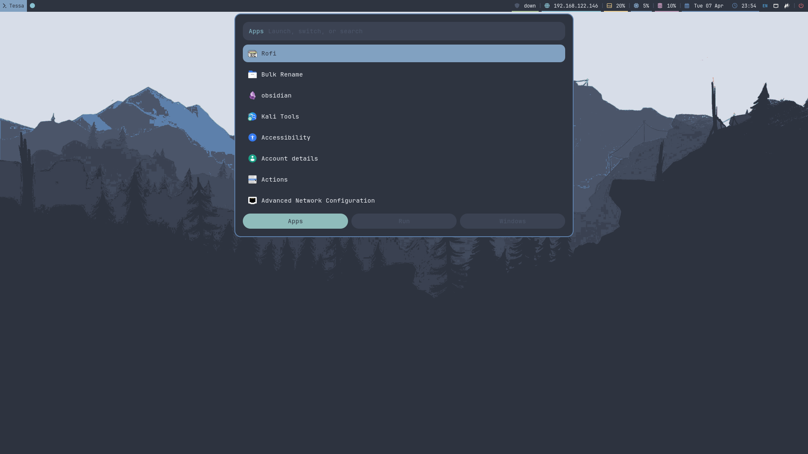
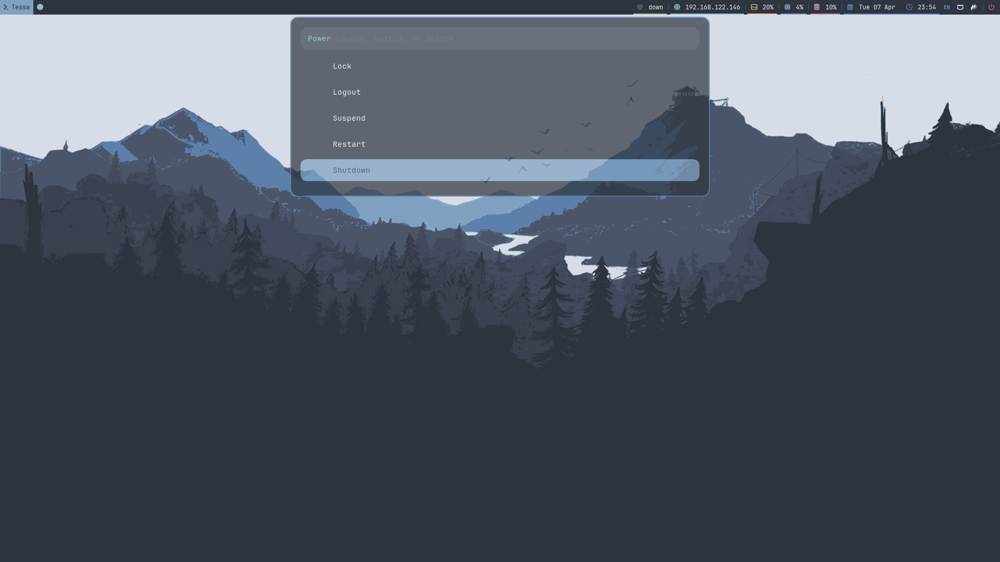
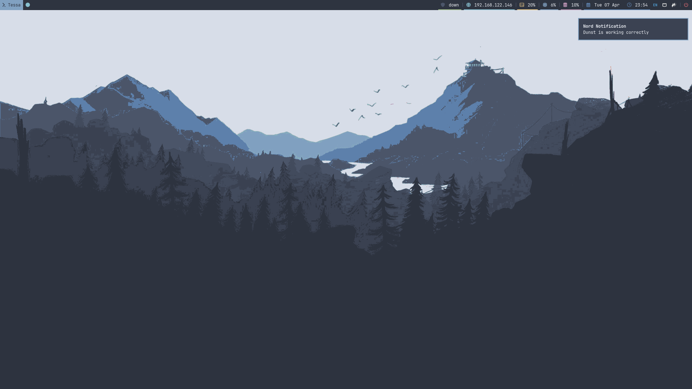

# Nord i3 Dotfiles

A Nord-themed i3 desktop environment for KVM/QEMU VMs. Includes i3, Polybar (Nerd Font icons), Alacritty, Rofi, tmux, picom, dunst, GTK 2/3/4, Firefox tweaks, and the Nordic GTK theme.

## Preview







## Included

- `i3wm` — Nord colors, vim-style navigation, workspace auto-back-and-forth
- `Polybar` — Nerd Font icons, VPN/ETH/disk/CPU/RAM/clock modules, rofi brand launcher, power menu
- `Alacritty` — Nord palette, JetBrains Mono 7.5pt
- `Rofi` — Nord theme, drun/run/window modes, rofi 2.0 compatible
- `tmux` — Nord statusline, Ctrl+Space prefix, vi copy mode
- `picom` — VM-safe xrender backend, fade effects, no shadows/blur
- `dunst` — Nord notification daemon, JetBrains Mono
- `GTK 2/3/4` — Nordic theme
- `Firefox` — userChrome.css, user.js, Papirus icons
- `Obsidian` — exported app config (opt-in, machine-specific)
- Nord mountain wallpaper (3840x2160)

## Layout

```text
.
├── assets
│   ├── screenshots
│   ├── themes/Nordic
│   └── wallpapers
├── configs
│   ├── alacritty
│   ├── dunst
│   ├── firefox
│   ├── gtk-3.0
│   ├── gtk-4.0
│   ├── i3
│   ├── obsidian
│   ├── picom
│   ├── polybar
│   ├── rofi
│   └── tmux
└── scripts
```

## Install

```bash
# Configs only (backs up existing files automatically)
./scripts/install.sh

# Install system packages first (apt-based)
./scripts/install.sh --install-packages

# All flags
./scripts/install.sh --install-packages        # apt install dependencies
./scripts/install.sh --install-obsidian        # download latest Obsidian .deb
./scripts/install.sh --apply-obsidian-config   # copy obsidian.json (machine-specific)
./scripts/install.sh --skip-reload             # don't reload i3/polybar/tmux
```

Backups are saved to `~/.config-backups/i3configs-repo-YYYYMMDD-HHMMSS/`.

## Keybindings

| Key | Action |
|-----|--------|
| `Super+Return` | Alacritty terminal |
| `Super+d` | Rofi app launcher |
| `Super+Shift+d` | Rofi run prompt |
| `Super+b` | Firefox |
| `Super+n` | Thunar |
| `Super+o` | Obsidian |
| `Super+q` | Kill window |
| `Super+h/j/k/l` | Focus left/down/up/right |
| `Super+Shift+h/j/k/l` | Move window |
| `Super+f` | Fullscreen |
| `Super+v` | Split vertical |
| `Super+g` | Split horizontal |
| `Super+Shift+space` | Toggle floating |
| `Super+y` | Toggle sticky window |
| `Super+x` | Lock screen (i3lock) |
| `Super+z` | Resize mode |
| `Super+[1-0]` | Switch workspace (auto-back-and-forth) |
| `Print` / `Super+Shift+s` | Screenshot (flameshot) |

## Polybar Modules

Click actions on all modules:

| Module | Left Click | Right Click |
|--------|-----------|-------------|
| Tessa (brand) | Rofi app launcher | Rofi window switcher |
| VPN | Copy VPN IP | Network settings |
| ETH | Network settings | Copy local IP |
| DSK/CPU/RAM | System monitor | — |
| Date | Calendar | — |
| Power | Lock/Logout/Suspend/Restart/Shutdown | — |

## Troubleshooting

**Targeted at KVM/QEMU VMs** — xrandr autostart uses `Virtual-1` at `1920x1080`. Change the resolution in `configs/i3/config` to match your VM display.

**Nerd Font icons missing** — install JetBrainsMono Nerd Font: download from [nerd-fonts releases](https://github.com/ryanoasis/nerd-fonts/releases), extract to `~/.local/share/fonts/`, run `fc-cache -f`.

**Polybar not starting** — ensure `polybar` is in `$PATH` and scripts are executable: `chmod +x ~/.config/polybar/*.sh`.

**picom tearing in VM** — the config uses `xrender` backend with vsync disabled. If issues persist, comment out `exec_always picom` in `configs/i3/config`.

**VPN shows "down"** — the script auto-detects `tun0`, `wg0`, `vpn0`, `tap0`. Add your interface to the loop in `configs/polybar/vpn-status.sh`.

**Rofi colors wrong** — requires rofi 2.0+. The theme uses `inherit` instead of `transparent` for proper color cascading.

**No notifications** — `dunst` is autostarted by i3. Test with `notify-send "test" "hello"`. Requires `libnotify-bin`.
